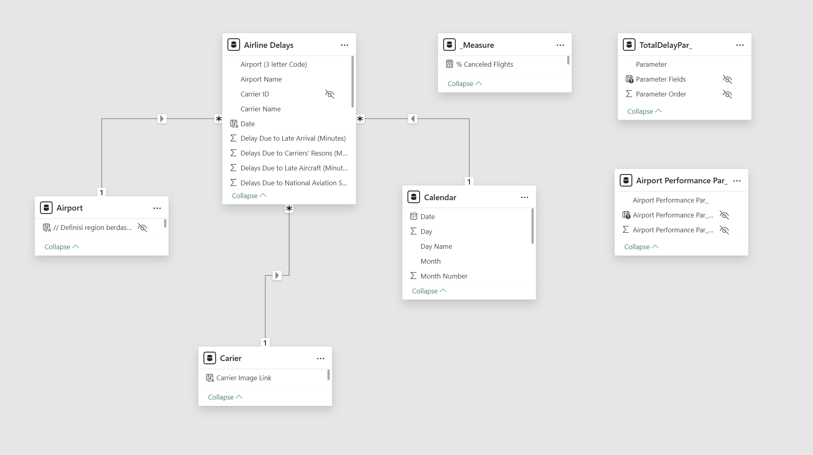
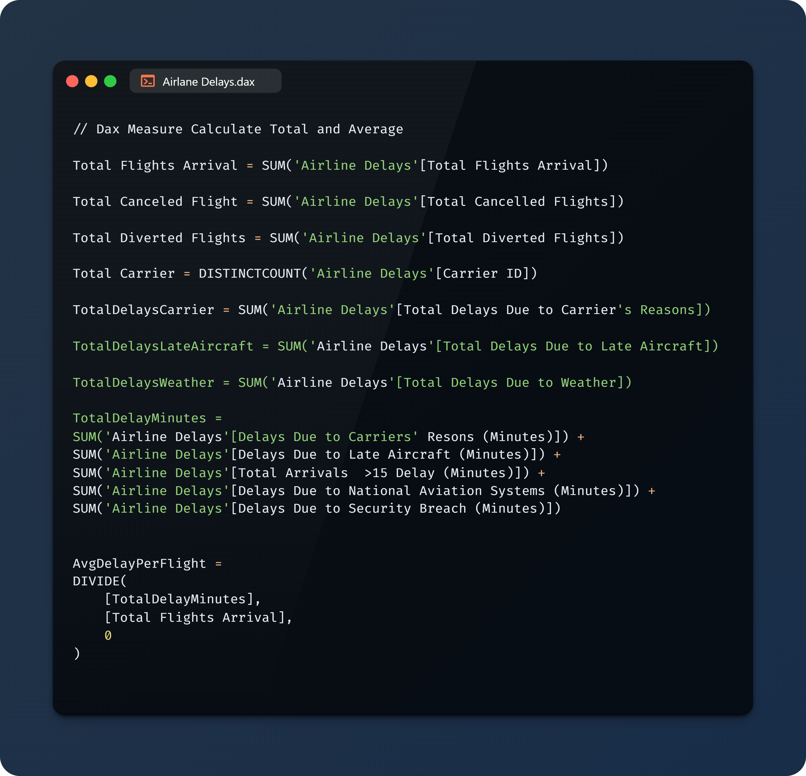
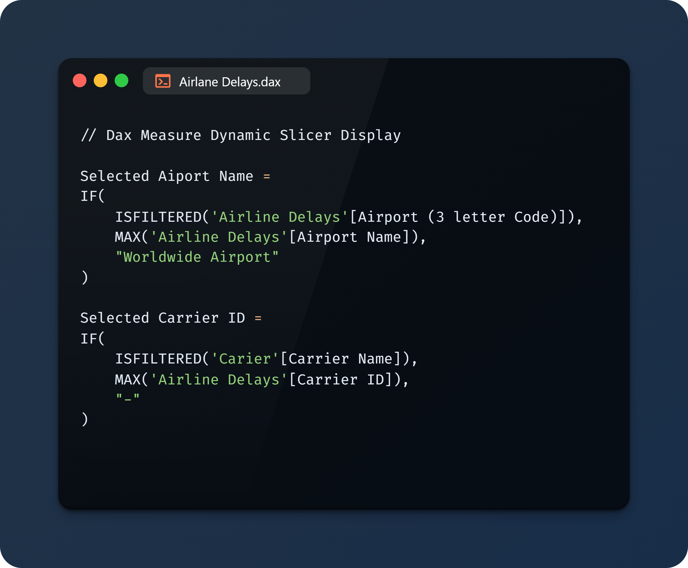
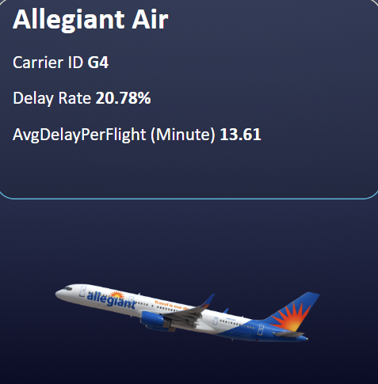
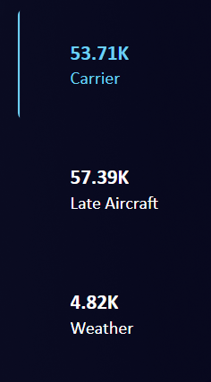
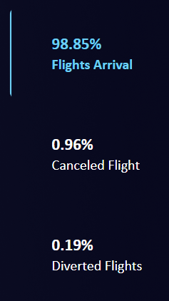

# Airline Delays

 

## 1. Introduction
From an industry-wide perspective, delays contribute to congestion at airports, inefficient air traffic management, and increased environmental impact due to excessive fuel burn and carbon emissions. The economic consequences extend beyond airlines to include airports, ground service providers, and businesses dependent on timely air travel, such as logistics and tourism industries.

## 2. Problem Statement
Understanding the key factors contributing to delays - ranging from weather conditions, air traffic congestion, and mechanical issues to staffing shortages, security procedures, and airline scheduling inefficiencies - is crucial for developing strategies to mitigate their occurrence. By leveraging data analytics, predictive modeling, and real-time monitoring, stakeholders can identify patterns, anticipate potential disruptions, and implement proactive solutions.
This analysis focuses on:
- Identifying the busiest months and airports for flights.
- Determining months with the highest delay rates.
- Analyzing delay patterns across different airlines.
- Examining primary causes of delays.
- Evaluating geographical patterns in delay occurrences.

## 3. Skills Demonstrated
- **Data Cleaning & Transformation** using Power Query
- **DAX Measures** for advanced calculations
- **Data Modeling** with relationships between fact and dimension tables
- **Interactive Dashboards** using Power BI visualizations
- **Power Query**: Using Power Query to clean, transform, and shape raw data into an analysis-ready format, ensuring accuracy and consistency.
- **Power BI Parameters**: Implemented a dynamic parameter allowing users to select different delay and flight categories . This enhances interactivity and enables focused analysis based on user selection. 

## 4. Data Sourcing
The dataset used in this project consists of airline delay data, including:
- Flight details (Year, Month, Airline, Airport Code, Total Flights, Delays)
- Delay breakdown (Carrier, Weather, Late Aircraft, etc.)
- Additional airport and carrier information

The Dataset Provide by **FP20 Analytics** 

More Information About This Challenge: [FP20 Analytics challenge 23]([https://zoomcharts.com/en/microsoft-power-bi-custom-visuals/challenges/onyx-data-january-2025](https://zoomcharts.com/en/microsoft-power-bi-custom-visuals/challenges/fp20-analytics-january-2025))

## 5. Data Transformation
Data preprocessing was performed using Power Query, including:
- Cleaning and structuring data
- Creating a Calendar table for time-based analysis
- Adding an Airport table with `Airport Code`, `Airport Name`, and `Airport Location`
- Adding a Carrier table with `Carrier Name` and `Carrier SVG Image`

## 6. Modeling
A relational data model was designed in Power BI with the following structure:
- **Fact Table:** `Airline Delays`
- **Dimension Tables:** `Calendar`, `Airport`, `Carrier`
- Relationships established between the fact and dimension tables

**Data Model Screenshot:**

### DAX Measures  
Here are some DAXs used for flight delay analysis:

#### Calculate Total and Average

#### Calculate Rate %

#### MoM Flight Arrival, Cenceled Flight, and Diverted FLight (The dax in the example is Flight Arrival)

#### Dynamic Slicer

##### Application Example

| Default | Filtered |
|----------|----------|
|  |  |

#### Selected Metric for better user understanding between `Delays` & `Flight`

##### Application Example

| Delays | Flight |
|----------|----------|
|  |  |

## 7. Analysis & Visualization
Key insights were extracted using Power BI visualizations and DAX measures, including:
- **KPIs:** Delay Rate, Average Delay Per Flight, On-Time Performance
- **Bar Charts & Line Charts** for trend analysis
- **Geographical Analysis** using airport locations

## 8. Conclusion
The analysis revealed significant insights:
- **Busiest Months:** January, April, May, October, November, December
- **Months with Highest Delay Rates:** May and July
- **Primary Delay Causes:** Late Aircraft, Carrier Delays, and Weather
- **Most Affected Airports:** DFW, ORD, MSP (due to weather delays)
- **Best On-Time Performers:** ExpressJet Airlines LLC and Hawaiian Airlines

**Recommendations:**
- Airlines should optimize schedules during peak months.
- Predictive analytics can help reduce delays.
- Improved coordination between airlines and airports can mitigate congestion.

---
### Additional Notes
- Add images for dashboards and DAX measures as needed.
- Update data model screenshot link before publishing.
