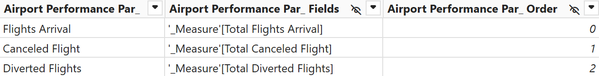

# Airline Delays

 

## 1. Introduction
From an industry-wide perspective, delays contribute to congestion at airports, inefficient air traffic management, and increased environmental impact due to excessive fuel burn and carbon emissions. The economic consequences extend beyond airlines to include airports, ground service providers, and businesses dependent on timely air travel, such as logistics and tourism industries.

## 2. Problem Statement
Understanding the key factors contributing to delays - ranging from weather conditions, air traffic congestion, and mechanical issues to staffing shortages, security procedures, and airline scheduling inefficiencies - is crucial for developing strategies to mitigate their occurrence. By leveraging data analytics, predictive modeling, and real-time monitoring, stakeholders can identify patterns, anticipate potential disruptions, and implement proactive solutions.
This analysis focuses on:
- Identifying the busiest months and airports for flights.
- Determining months with the highest delay rates.
- Analyzing delay patterns across different airlines.
- Examining primary causes of delays.
- Evaluating geographical patterns in delay occurrences.

## 3. Skills Demonstrated
- **Data Cleaning & Transformation** using Power Query
- **DAX Measures** for advanced calculations
- **Data Modeling** with relationships between fact and dimension tables
- **Interactive Dashboards** using Power BI visualizations
- **Power Query**: Using Power Query to clean, transform, and shape raw data into an analysis-ready format, ensuring accuracy and consistency.
- **Power BI Parameters**: Implemented a dynamic parameter allowing users to select different delay and flight categories . This enhances interactivity and enables focused analysis based on user selection. 

## 4. Data Sourcing
The dataset used in this project consists of airline delay data, including:
- Flight details (Year, Month, Airline, Airport Code, Total Flights, Delays)
- Delay breakdown (Carrier, Weather, Late Aircraft, etc.)
- Additional airport and carrier information

The Dataset Provide by **FP20 Analytics** 

More Information About This Challenge: [FP20 Analytics challenge 23]([https://zoomcharts.com/en/microsoft-power-bi-custom-visuals/challenges/onyx-data-january-2025](https://zoomcharts.com/en/microsoft-power-bi-custom-visuals/challenges/fp20-analytics-january-2025))

## 5. Data Transformation
Data preprocessing was performed using Power Query, including:
- Cleaning and structuring data
- Creating a Calendar table for time-based analysis
- Adding an Airport table with `Airport Code`, `Airport Name`, and `Airport Location`
- Adding a Carrier table with `Carrier Name` and `Carrier SVG Image`

## 6. Modeling
A relational data model was designed in Power BI with the following structure:
- **Fact Table:** `Airline Delays`
- **Dimension Tables:** `Calendar`, `Airport`, `Carrier`
- Relationships established between the fact and dimension tables

**Data Model Screenshot:**

### Create Parameters

#### Flight

| Parameter | Result |
|----------|----------|
|  |  |

#### Delays

| Parameter | Result |
|----------|----------|
|  |  |

### DAX Measures  
Here are some DAXs used for flight delay analysis:

#### Calculate Total and Average

#### Calculate Rate %

#### MoM Flight Arrival, Cenceled Flight, and Diverted FLight (The dax in the example is Flight Arrival) & Conditional Formating color to Clarify the Metric

#### Dynamic Slicer

##### Application Example

| Default | Filtered |
|----------|----------|
|  |  |

#### Selected Metric for better user understanding between `Delays` & `Flight`

##### Application Example

| Delays | Flight |
|----------|----------|
|  |  |

## 7. Analysis & Visualization
Key insights were extracted using Power BI visualizations and DAX measures, including:
- **KPIs:** Delay Rate, Average Delay Per Flight, On-Time Performance, and Flight Category
- **Bar Charts & Line Charts** for trend analysis
- **Geographical Analysis** using airport locations

In this Dashboard there are 3 pages :

- Overview
- Flight
- Delay 

You can interact with report here [FP 20 Analytics Challenge](-)

 

## **Insights**

### **1. Busiest Months and Airports for Flights**
- January, April, May, October, November, and December have the highest flight volumes.
- The busiest airports are ATL (Hartsfield-Jackson Atlanta International Airport), DFW (Dallas/Fort Worth International Airport), and ORD (Chicago O'Hare International Airport).

### **2. Months with the Highest Delay Rates**
- May and July experience the highest delay rates, with an average delay rate of 21.5%.

### **3. Primary Causes of Delays**
- The main cause of flight delays is
  - Late Aircraft (57.39K affected flights)
  - Carrier-related delays (53.71K flights)
  - Weather (4.82K flights)

### **4. Airports Most Affected by Weather-Related Delays**
- DFW (Dallas/Fort Worth International Airport), ORD (Chicago O'Hare International Airport), and MSP (Marcos Paz Airfield) experience the most significant weather-related delays, adding 10-12 minutes per flight on average.

### **5. Geographic Patterns in Delay Occurrences**
- Coastal airports face significantly more delays than inland airports, with a ratio of 90% to 10%.

### **6. Regions Most Affected by Weather-Related Delays**
- North America is the most affected region, with 4.1K flights delayed due to weather conditions.

### **7. Percentage of Flights Experiencing Delays Over 15 Minutes**
- The average delay per flight is 10.75 minutes, with a substantial number exceeding 15 minutes.

## **Conclusion**

- High-traffic months correlate with increased delays, primarily due to air traffic congestion and operational bottlenecks.
- Late aircraft remains the leading cause of delays, followed by carrier-related issues and weather disruptions.
- Coastal airports tend to suffer more delays due to operational complexities and weather conditions.
- Airlines with efficient operational strategies, such as ExpressJet and Hawaiian Airlines, experience fewer delays.
- Effective data-driven strategies can enhance flight punctuality and reduce overall delays across the industry.

## **Recommendations**

### **For Airlines:**
- Implement predictive analytics to anticipate and mitigate delays by optimizing flight schedules.
- Adopt operational strategies from low-delay airlines, such as better fleet rotation and optimized scheduling.
- Improve turnaround times to minimize cascading delays from late aircraft.

### **For Airports:**
- Expand infrastructure and optimize scheduling in high-traffic months to alleviate congestion.
- Enhance weather prediction and monitoring systems to proactively manage weather-related disruptions.
- Improve ground operations to ensure smoother aircraft movement and reduce delays.

### **For Aviation Authorities:**
- Increase coordination between airlines, airports, and air traffic control to enhance traffic management.
- Develop policies to encourage best practices in airline scheduling and airport management.
- Promote investments in technological advancements to enhance efficiency and reduce delays.

---
### Repository Contents  
- **Power BI Dashboard File**: The main [PBIX File](https://zoomcharts.com/en/microsoft-power-bi-custom-visuals/challenges/submission/7aca2655f8c02f248638caa5fce9dc9e?challenge=onyx-data-january-2025) containing the analysis and visualizations. 
- **Data Sources**: [Raw Dataset](Airline_Delays_English_C23.xlsx) used in the project.  
- **Screenshots/Reports**: Exported visualizations for sharing insights.  
- **README.md**: Project documentation (this file).
